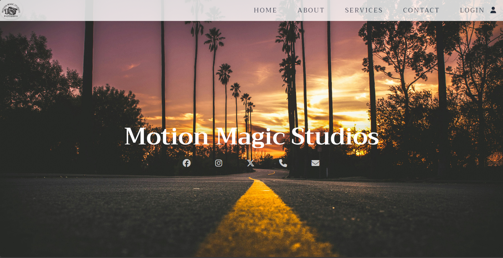
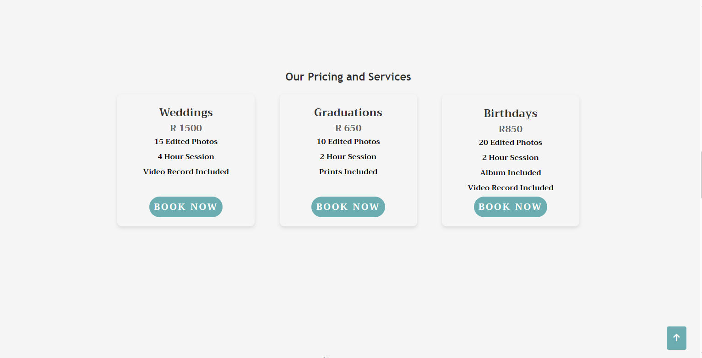
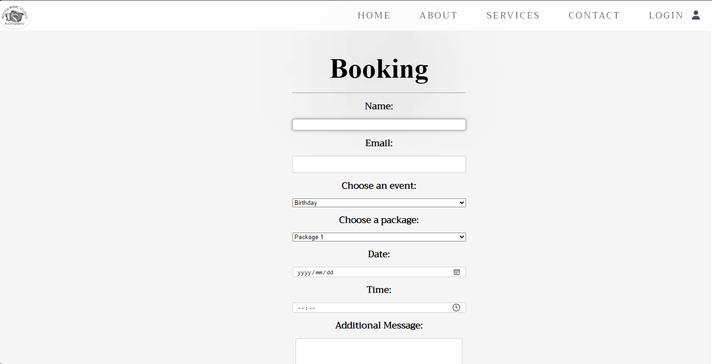
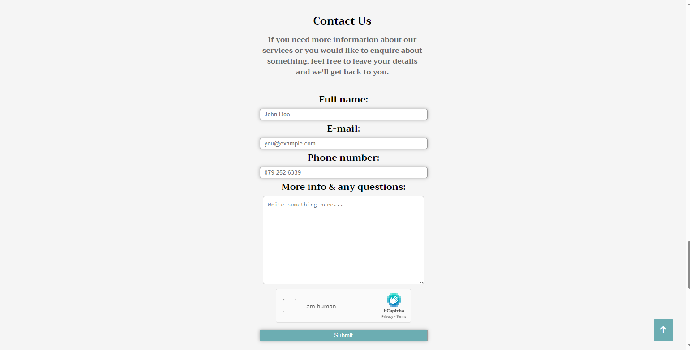

# Motion Magics Studios 
## WebApp:
A website that shows a photography business that will be gradually built during the course at CapaCiti. The website shows different photography services offered and packages to choose from. You are also able to view dates available for bookings and locate the premises of the business.

## Demo :
Here is a working live demo : https://motionmagicstudios.netlify.app/

## Site

### Landing Page:

### About Page: 

### Services Page:

### Bookings Page:

### Contact Page: 

## [Usage](https://github.com/SMGxowa1/HTML-Website)

### Development
Want to contribute? Great!

To fix a bug or enhance an existing module, follow these steps:

- Fork the repo
- Create a new branch (`git checkout -b improve-feature`)
- Make the appropriate changes in the files
- Add changes to reflect the changes made
- Commit your changes (`git commit -am 'Improve feature'`)
- Push to the branch (`git push origin improve-feature`)
- Create a Pull Request 

## Built with 

-[HTML] (https://www.w3schools.com/html/) 

## To-do
- Add CSS for styling.
- Add JavaScript for functionality.
- Add a database for information storage.

## Team

-[Siyamthanda](https://github.com/SMGxowa1)
-[Aphiwe](https://github.com/AphiweSkeyi00)
-[Yanelisa](https://github.com/Yanelisa1)
-[Anitha](https://github.com/anithasagwityi)
-[Chulumanco](https://github.com/ChulumancoNdela)
